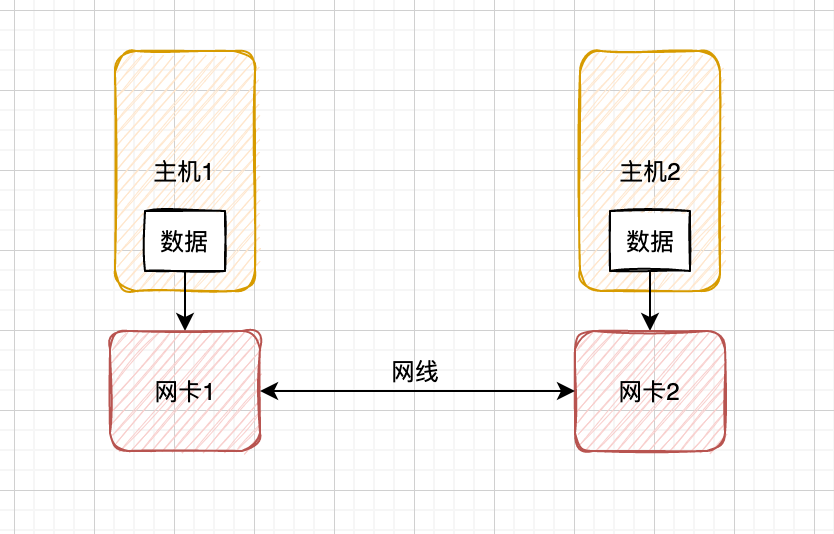
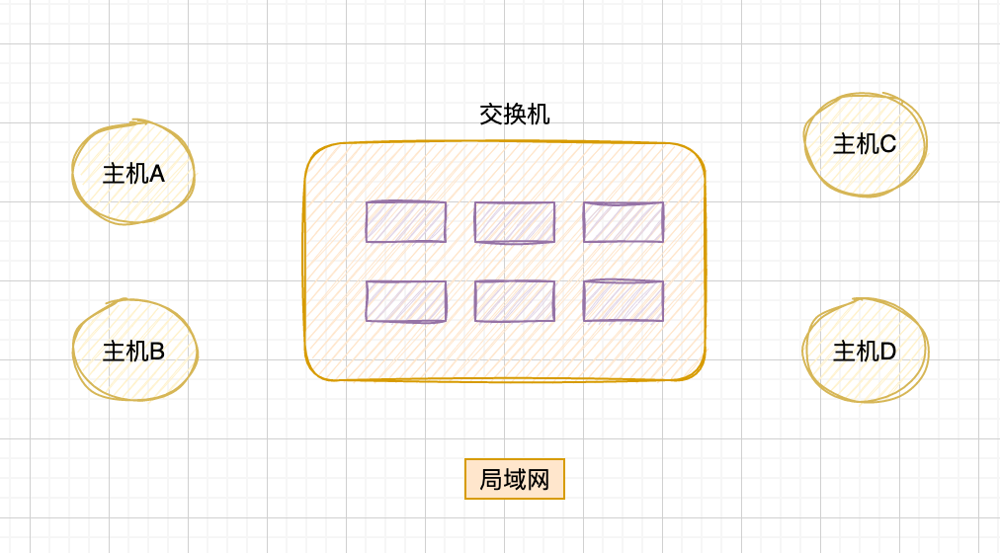
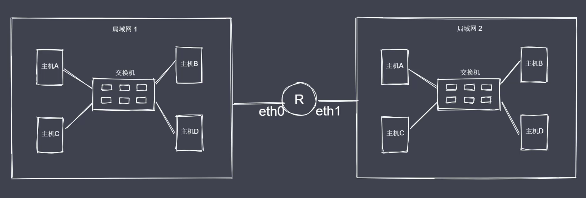

# 通信

## 网络通信基本原理

## 通信必要条件

- 主机之间需要有传输介质，如网线，传输的是电信号
- 主机上必须有网卡设备，将数据转换为电信号
- 主机之间需要协商网络速率，否则会造成数据丢失等问题



```js
const a = 111
```

## 网络通讯方式

- 交换机通讯
- 路由器通讯



主机之间通信通过交换机或者路由器来完成，比如主机 A 发消息给 B，A 会首先将数据传输到交换机，然后交换机通过广播的方式传输给主机 B、C、D。主机的网卡会接收发给自己的消息，比如 B 的网卡会接受数据，而 C、D 的网卡会丢弃数据。

每个主机网卡都有一个 Mac 地址，即物理地址。交换机通过 Mac 地址来定位主机。

存在的问题：

- 交换机的接口数量有上限，无法将所有电脑放在一个局域网内。
- 局域网存在大量主机会造成广播风暴。

所以出现了城域网，到现在的互联网。



不同局域网的数据，通过 ip 来定位。

## 创建 TCP 通信

通信事件&方法

- listening: 服务开始监听时触发
- connection: 服务每次连接时触发
- close: 服务关闭时触发
- error: 服务出现错误时触发
- data 事件
- write 方法：在 socket 上发送数据，默认是 UTF8 编码。
- end 操作：当 socket 的一端发送 FIN 包时触发，结束可读端


## TCP 数据粘包

- 数据端会有一个缓冲区，累积数据统一发送，发送时机取决于 TCP 拥塞机制。
- 接收端也有一个缓冲区，进行消费，这里回出现粘包问题。
