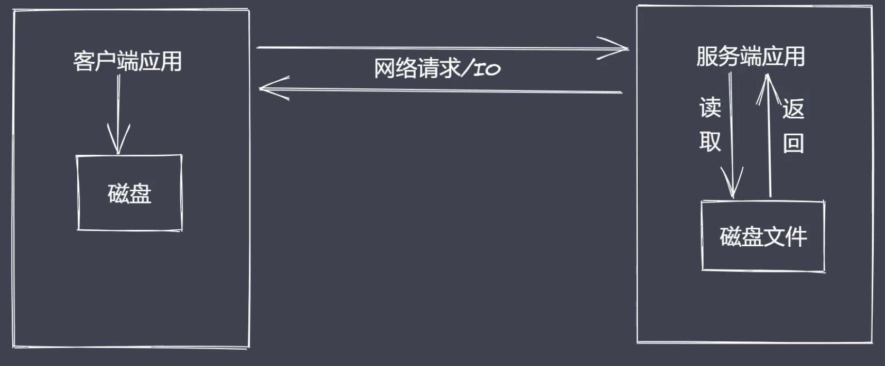
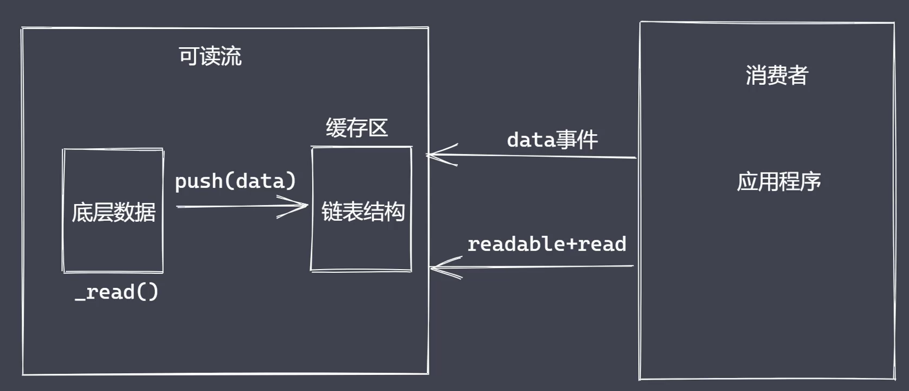

# Stream

文件操作系统和网络模块实现了流接口。

Nodejs 中的流是处理流式数据的抽象接口。

## 为什么要用流处理数据

如看电影时，大文件，如 1g，不能用 readFile 这样的方法，因为 readFile:

- 文件读取是同步的
- 资源文件最终会一次性加载到内存

流

- 时间效率：分段处理可以同时操作多个数据 ？？
- 空间效率：同一时间流无需占据大内存空间
- 使用方便：流配合管道，扩展程序变得简单
  

## Node 中的流分类

- Readable: 可读流，能够实现数据的读取
- Writeable:可写流， 能够实现数据的写操作
- Duplex:双工流， 既可读又可写
- Tranform:转换流, 可读可写，还能实现数据转换

Node 流特点

- Stream 模块实现了四个具体的抽象
- 所有流都继承了 EventEmitter

### 可读流

可读流：生产供消费的数据流

自定义可读流

- 继承自 stream 里的 Readable
- 重写 \_read 方法调用 push 产出数据

问题：

- 底层数据读取完成之后如何处理？传 null 表示读取完成
- 消费者如何获取可读流中的数据？两个事件
  - readable：流中存在可读取数据时触发
  - data: 流中数据块传给消费者后触发

流动模式
暂停模式

### 可写流

可写流：用于消费的流

自定义可写流

- 继承自 Writable
- 重写 `_write` 方法

可写流事件

- pipe: 可读流调用 `pipe()` 方法时触发
- unpipe: 可读流调用 `unpipe()` 方法时触发
- drain

### Duplex 双工流

### Transform 转换流

自定义转换流

- 继承 Transform 类
- 重写 _transform 方法，调用 push 和 callback
- 重写 _flush 方法，处理剩余数据

### 文件可读流
