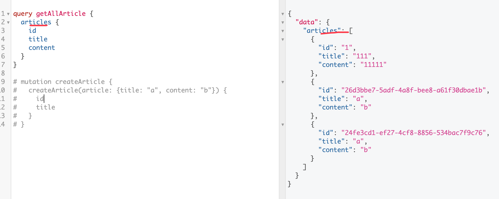

# GraphQL

## 类型

### Query

- Query 必须有，且只有一个。
- Query 是所有查询的入口点。
- Query 严格来说是一种对象类型。

### 标量类型

- getNamedType
- getNullableType
- GraphQLBoolean
- GraphQLEnumType
- GraphQLFloat
- GraphQLID: 会被转为字符串
- GraphQLInputObjectType
- GraphQLInt
- GraphQLInterfaceType
- GraphQLList
- GraphQLNonNull
- GraphQLObjectType
- GraphQLScalarType
- GraphQLSchema
- GraphQLString
- GraphQLUnionType
- isAbstractType
- isCompositeType
- isInputType
- isLeafType
- isOutputType

```js
const PersonType = new GraphQLObjectType({
  name: "Person",
  fields: () => ({
    name: { type: GraphQLString },
    children: {
      type: new GraphQLList(PersonType),
    },
    age: {
      type: GraphQLInt,
      defaultValue: 0
    }
  }),
});

const schema = new GraphQLSchema({
  query: new GraphQLObjectType({
    name: "RootQueryType",
    fields: {
      foo: {
        type: GraphQLString,
        resolve() {
          return "hello";
        },
      },
      age: {
        type: GraphQLInt,
        resolve() {
          return 12;
        },
      },
      users: {
        type: PersonType,
        resolve(obj) {
          // obj 对象，就是根对象, 如 obj.age
          return {
            name: "zs",
            children: [
              {
                name: "lisi",
              },
            ],
          };
        },
      },
    },
  }),
});

// 默认是可以为 null 的，如果没有 resolve 会返回 null
// 不能为空 GraphQLNonNull
var GeoPoint = new GraphQLInputObjectType({
  name: 'GeoPoint',
  fields: {
    lat: { type: new GraphQLNonNull(GraphQLFloat) },
    lon: { type: new GraphQLNonNull(GraphQLFloat) },
    alt: { type: GraphQLFloat, defaultValue: 0 },
  }
});
```

### 查询参数

```
{
  name
  age
  article(id: "1") {
    id
  }
}
```

## Mutation

```
query getAllArticle {
  articles {
    id
    title
    content
  }
}

# 这里 createArticle 相当于是个组合
# mutation createArticle {
#   createArticle(article: {title: "a", content: "b"}) {
#     id
#     title
#   }
# }
```



## 客户端传参数

1. 字符串拼接

2. variables 变量

```js
axios({
  methods: 'POST',
  url: 'http://localhost:4000/graphql',
  data: {
    query: `
      query getArticle($id: ID!) {
        article(id: $id) {
          id
          title
        }
      }
    `,
    variables: {
      id: 2
    }
  }
})
```
